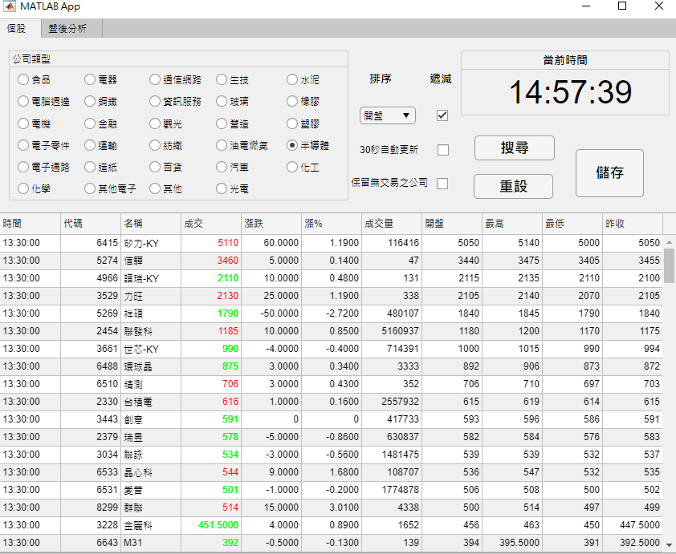
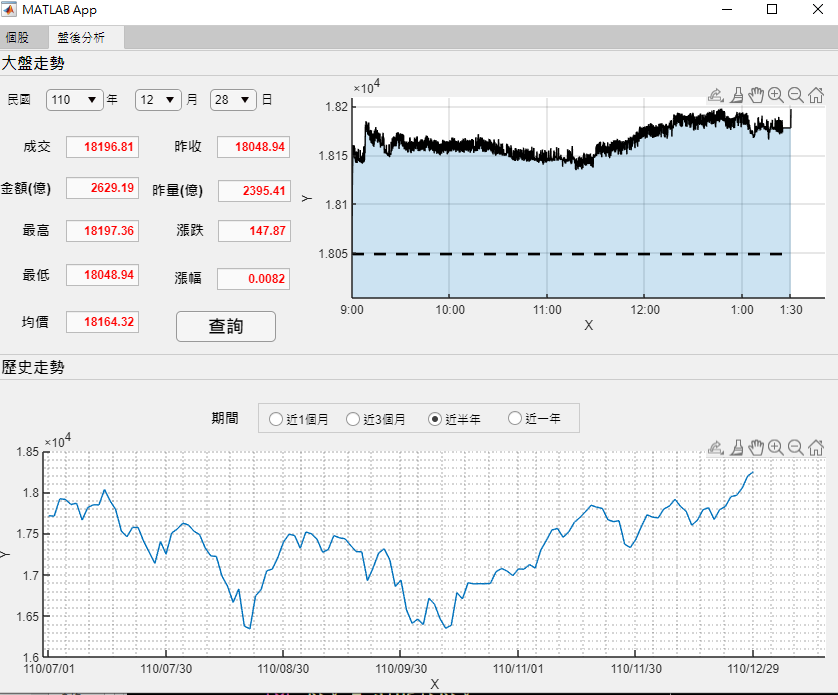

# MATLAB - Stocks Information GUI System

A Presentation of Taiwan Stocks Information System using Crawling HTML techniques by MATLAB (APP).

## Stocks information :

Taiwan Stocks : https://www.cnyes.com/twstock/stock_astock.aspx?ga=nav#

## Functionality

Classify stocks type, where users can choose what they are interesting.

Auto-update, the period can be modify in source code.

Sort by features.

Overview in a certain period.

others introduction in ReadMe.pdf file.

The example shown as following:

  

    
  

  

       
  

